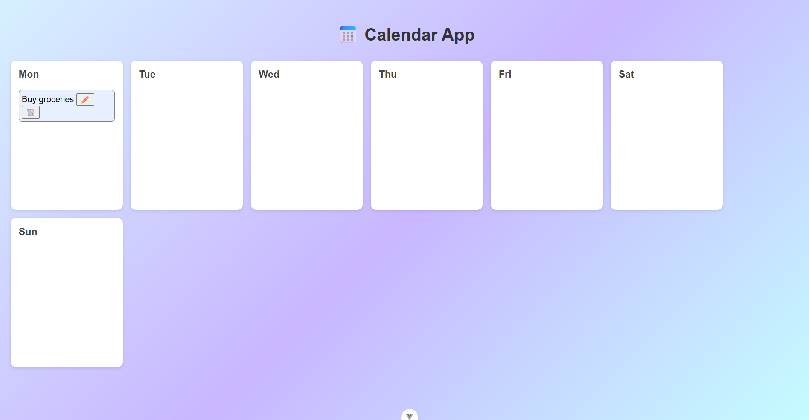
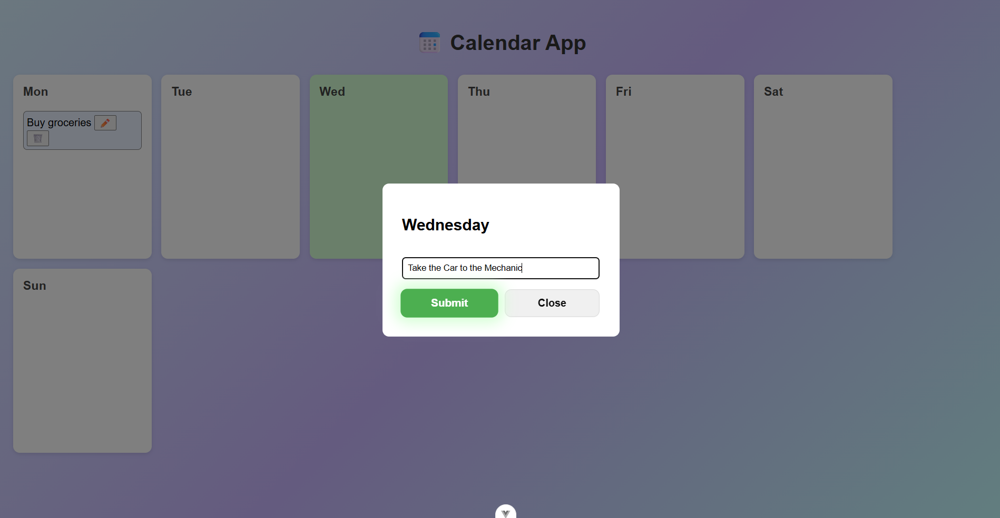
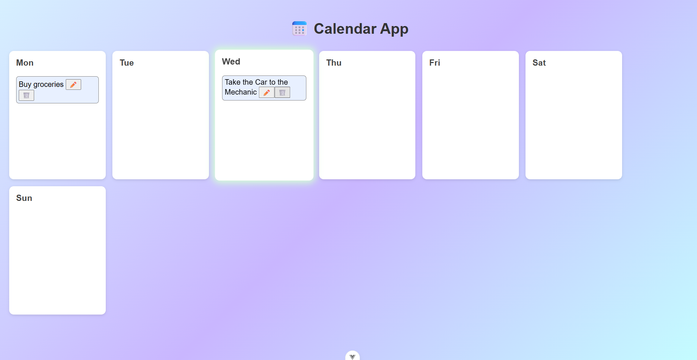
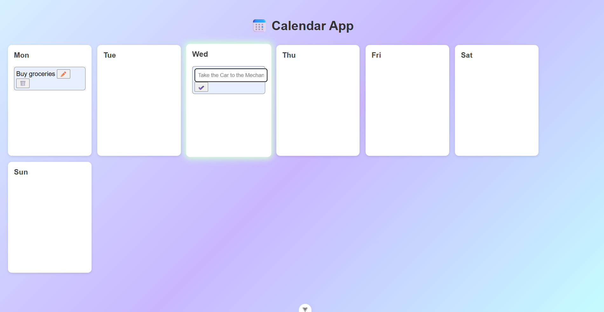

# Calendar App 📅 
A weekly-based calendar app built using Vue JS (Front-End Framework).

## Features
- View the events for each day of the week.
- Add new events to any selected day.
- Edit the events.
- Remove the events.

## Technologies
- Vue JS
- HTML
- CSS

## Screenshots

## How to Run the Web App
1. Clone the repository into a folder.
2. Open the folder in VS Code.
3. In the command line, run 'npm run dev'.
